# Kidz-book-web
畢業設計｜兒童繪本平台，Vue3 + FastAPI，前後端分離
 ⚠️ 環境與 API 備註 本專案原始程式碼使用 DashScope 國內節點 Qwen API 做文字生成。 DashScope 國內端點有地域與帳號門檻，台灣網路環境無法穩定存取這個國內 endpoint，且需要大陸手機註冊的 API Key。

圖像生成使用獨立的 Pollinations 公共圖像 API，該服務無 SLA，延遲浮動，可能逾時。

因此提供預錄 Demo 影片作為執行樣例。影片內所有繪本內容，都是用這套程式、在原本開發環境下完整跑出来的結果。 如果想要在台灣本地執行這套程式，需要修改程式，把 LLM 替換成可跨區存取的模型（例如 DashScope 國際節點、其他 LLM 服務），修改 endpoint 與對應金鑰。

本項目為作品集原型，重點驗證「LLM 產生幼兒故事 + 批量呼叫圖像 API 生成繪本插圖」的端到端流程，並非生產級部署服務。

## 專案截圖
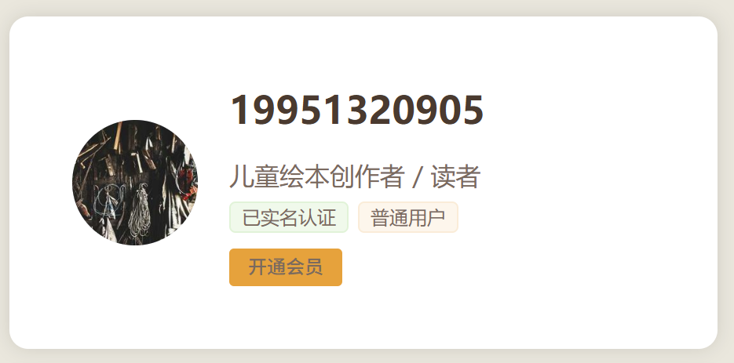
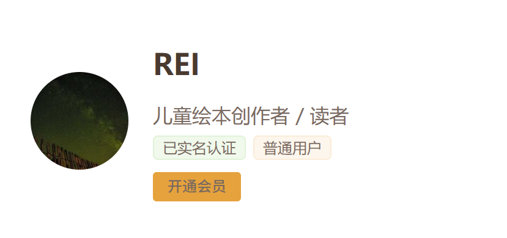
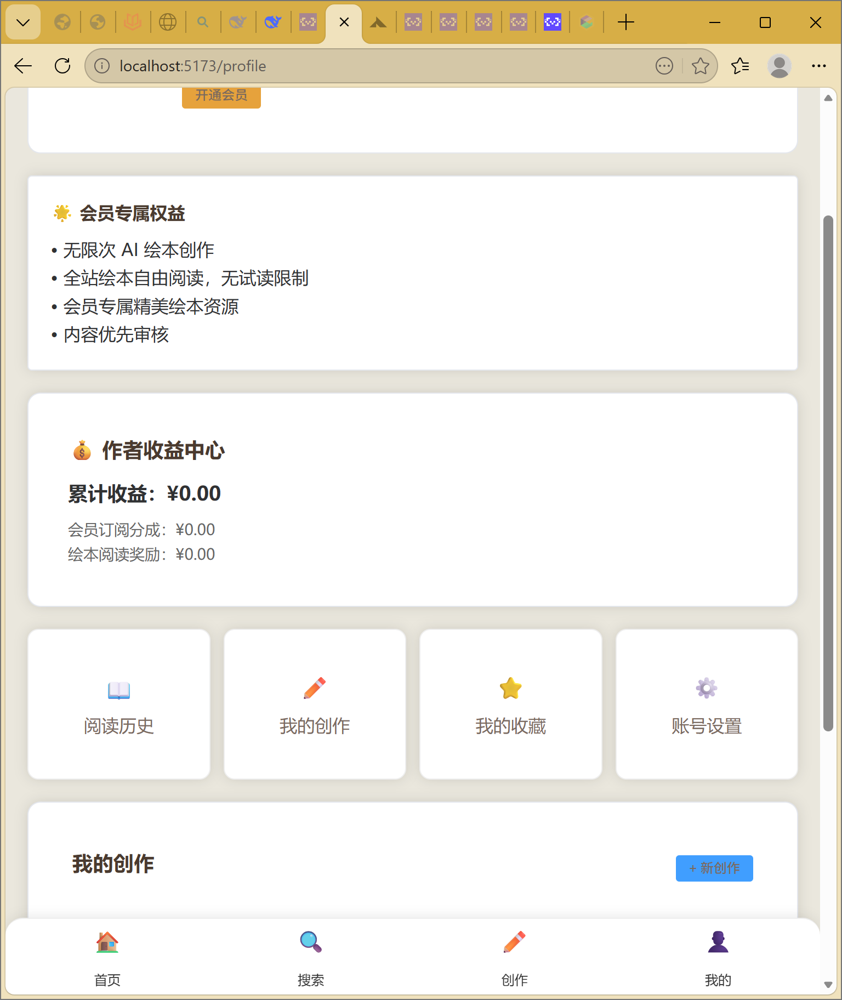
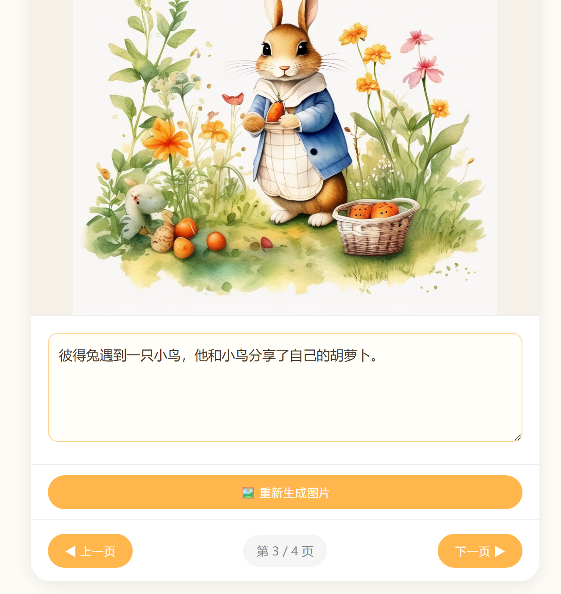
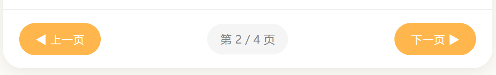
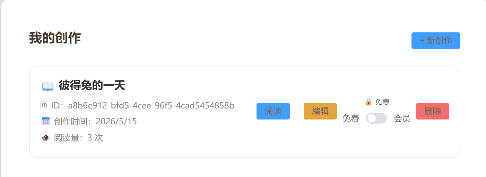
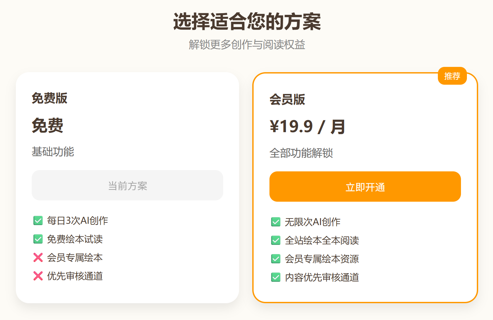
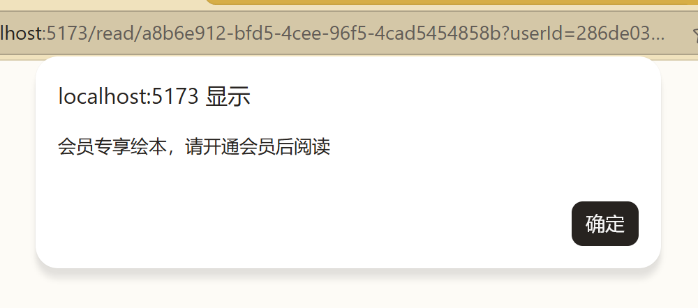
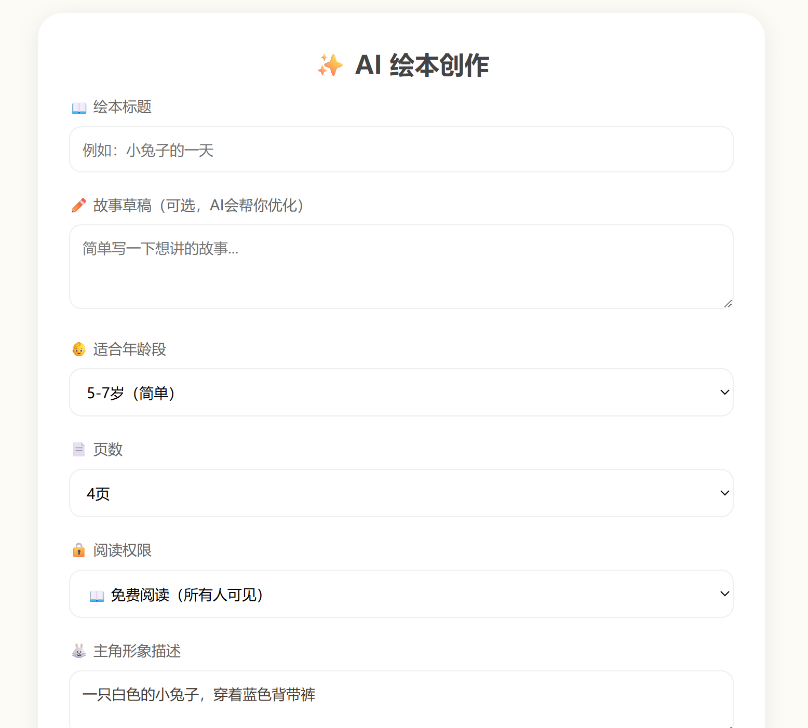
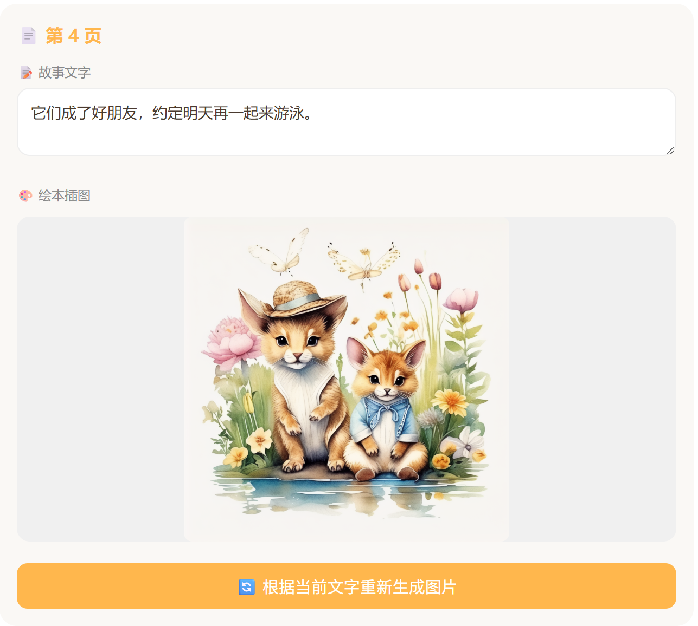
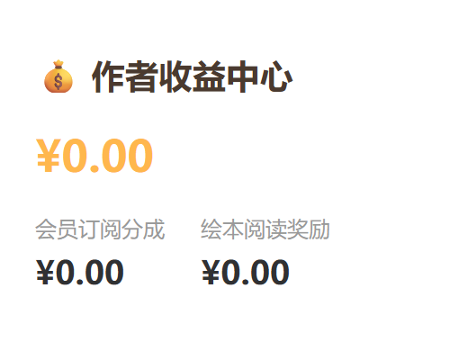

## 功能簡介
- 兒童繪本線上創作、編輯
- 繪本翻頁閱讀
- 會員權限管理
- 創作記錄管理
- 收益中心